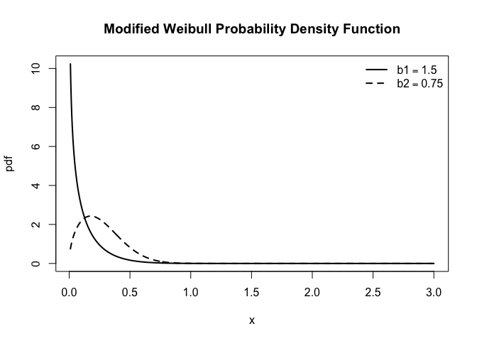
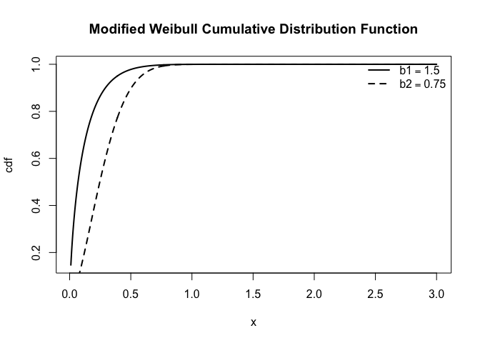
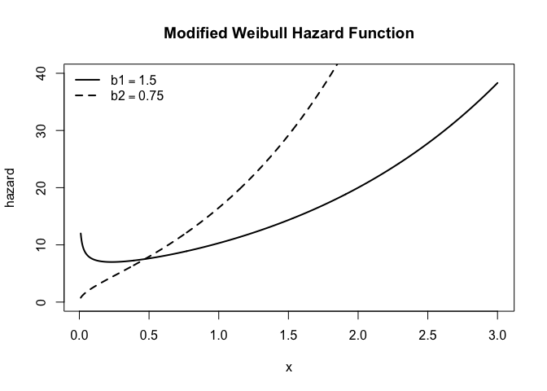
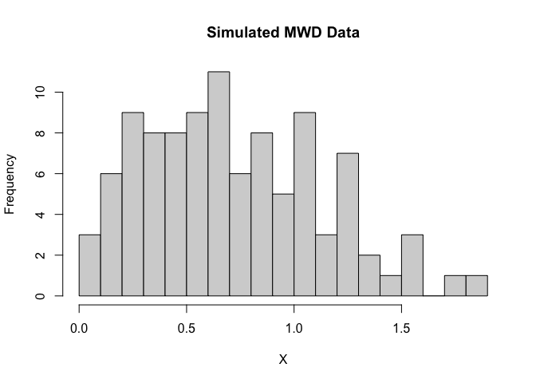

Dependent Stress-Strength Reliability Model with Modified Weibull
Distribution Marginals via Clayton Copula

<!-- README.md is generated from README.Rmd. Please edit that file -->

<!-- badges: start -->

<!-- [](https://cran.r-project.org/package=SSReliabilityClaytonMWD) -->

<!-- [] -->

<!-- (https://github.com/fatihki/SSReliabilityClaytonMWD/actions) -->


[](https://github.com/fatihki/SSReliabilityClaytonMWD/actions/workflows/R-CMD-check.yaml)
<!-- [](https://codecov.io/gh/fatihki/SSReliabilityClaytonMWD) -->
[](LICENSE)

<!-- [![DOI] -->

<!-- badges: end -->

## Overview

This R package, `SSReliabilityClaytonMWD`, implements dependent
stress–strength reliability (SSR) model with Modified Weibull marginals
and a Clayton copula for dependence, based on the study by [Kızılaslan
(2026)](https://arxiv.org/abs/2604.12130).

The package includes:

- Density, distribution, quantile, and random generation functions for
  MWD
- Estimation of MWD parameters using:
  - Maximum Likelihood Estimation (MLE)
  - Least Squares Estimation (LSE)
  - Weighted Least Squares Estimation (WLSE)
  - Maximum Product of Spacings (MPS)
- Dependent SSR modeling via Clayton copula
- Estimation of SSR via MLE, LSE, WLSE, MPS
- Asymptotic confidence intervals (ACI)
- Bootstrap confidence intervals (BCIs)

------------------------------------------------------------------------

## Installation

You can install the development version from GitHub:

``` r
# install.packages("remotes")
remotes::install_github("fatihki/SSReliabilityClaytonMWD")
```

## MWD Distribution

The modified Weibull distribution (MWD), introduced by [Lai et
al. (2003)](https://doi.org/10.1109/TR.2002.805788), which has been
widely used in reliability and survival analysis. A random variable $X$
is said to follow a modified Weibull distribution if its cumulative
distribution function (cdf) $F(x)$ and probability density function
(pdf) $f(x)$ are given by
$F(x) = 1- \exp \big( -a x^b e^{\lambda x} \big)$ and
$f(x) = a (b + \lambda x) x^{b-1} e^{\lambda x} \exp \big( -a x^b e^{\lambda x} \big)$,
where $x>0$, $a>0$ is the scale parameter, $b \ge 0$ is a shape
parameter, and $\lambda \ge 0$ is an acceleration or flexibility
parameter that controls how quickly the hazard grows over time. When
$\lambda=0$, it reduces to the two-parameter Weibull distribution with
$F(x) = 1- \exp(-a x^b)$. When $b=0$, it reduces to a type I
extreme-value (or log-gamma) distribution with
$F(x) = 1- \exp(-a  e^{\lambda x} )$.

### Density Function

``` r

# Parameters
a1 <- 5; b1 <- 0.75; lambda1 <- 0.5
a2 <- 5; b2 <- 1.5; lambda2 <- 0.5

x <- seq(1e-02, 3, length.out = 1000)

# First curve
plot(x, dMweibull(x, a1, b1, lambda1),
     type = "l", lwd = 2, lty = 1,
     xlab = "x", ylab = "pdf",
     main = "Modified Weibull Probability Density Function")

# Second curve
lines(x, dMweibull(x, a2, b2, lambda2),
      lwd = 2, lty = 2)
# Legend
legend("topright",
       legend = c(expression(b1==1.5), expression(b2==0.75)),
       lty = c(1, 2),
       lwd = 2,  bty = "n")
```

<!-- -->

### Cumulative Distribution Function

``` r
plot(x, pMweibull(x, a1, b1, lambda1), type = "l", lwd = 2,  lty = 1,
     xlab = "x", ylab = "cdf",
     main = "Modified Weibull Cumulative Distribution Function")
# Second curve
lines(x, pMweibull(x, a2, b2, lambda2),
      lwd = 2, lty = 2)
# Legend
legend("topright",
       legend = c(expression(b1==1.5), expression(b2==0.75)),
       lty = c(1, 2),
       lwd = 2,  bty = "n")
```

<!-- -->

### Hazard Function

``` r
plot(x, hMweibull(x, a1, b1, lambda1), type = "l", lwd = 2, lty = 1,
     xlab = "x", ylab = "hazard",  ylim = c(0,40),
     main = "Modified Weibull Hazard Function")
# Second curve
lines(x, hMweibull(x, a2, b2, lambda2),
      lwd = 2, lty = 2)
# Legend
legend("topleft",
       legend = c(expression(b1==1.5), expression(b2==0.75)),
       lty = c(1, 2),
       lwd = 2,  bty = "n")
```

<!-- -->

### Random Sample Generation

``` r
a <- 0.75; b <- 1.25; lambda <- 0.6
set.seed(123)
X <- rMweibull(100, a, b, lambda)
hist(X, breaks = 20, main = "Simulated MWD Data", xlab = "X")
```

<!-- -->

### Fitting the Modified Weibull Distribution

Estimation of MWD parameters using MLE, LSE, WLSE and MPS methods.

``` r
# Fit Modified Weibull Distribution
set.seed(123)
init <- runif(3)
fit.mle <- fitMWD( data = X, est.method = "mle", opt.method = "L-BFGS-B", starts = init,
  lower = c(1e-05, 1e-05, 1e-05), upper = c(Inf, Inf, Inf))
fit.lse <- fitMWD( data = X, est.method = "lse", opt.method = "L-BFGS-B", starts = init,
  lower = c(1e-05, 1e-05, 1e-05), upper = c(Inf, Inf, Inf))
fit.wlse <- fitMWD( data = X, est.method = "wlse", opt.method = "L-BFGS-B", starts = init,
  lower = c(1e-05, 1e-05, 1e-05), upper = c(Inf, Inf, Inf))
fit.mps <- fitMWD( data = X, est.method = "mps", opt.method = "L-BFGS-B", starts = init,
  lower = c(1e-05, 1e-05, 1e-05), upper = c(Inf, Inf, Inf))
# estimates results
```

|      |       a |       b |  lambda |
|:-----|--------:|--------:|--------:|
| True | 0.75000 | 1.25000 | 0.60000 |
| MLE  | 0.72316 | 1.26009 | 0.65591 |
| LSE  | 0.92991 | 1.40695 | 0.40209 |
| WLSE | 0.92201 | 1.42281 | 0.42073 |
| MPS  | 0.71406 | 1.18911 | 0.64607 |

Similarly, the two-parameter Weibull distribution can be also fitted to
data by`SSReliabilityClaytonMWD::fitWD`.

### Dependent SSR model

The stress–strength reliability $R = P(X > Y)$ under a dependent
framework, where both stress $X$ and strength $Y$ variables follow MWD
and their dependence is modeled via a Clayton copula.

The joint distribution function of the two-dimensional Clayton copula,
along with its joint probability density function, are given by
$C_{\theta}(u,v) = (u^{-\theta} + v^{-\theta} - 1)^{-1/\theta}$ and
$c_{\theta}(u,v) = (\theta +1)  u^{-(\theta + 1)} v^{-(\theta + 1)} \big( u^{-\theta} + v^{-\theta}-1 \big)^{-\left (\frac{1}{\theta} + 2 \right)}$,
where $\theta >0$. When $X \sim MWD(a_1,b_1,\lambda_1)$,
$Y \sim MWD(a_2,b_2,\lambda_2)$ with the two-dimensional Clayton copula
from, $R$ becomes
$R = \int_{0}^{\infty}  F_X(x)^{-(\theta + 1)} \big(F_X(x)^{-\theta} + G_Y(x)^{-\theta}-1 \big) ^{-\left (\frac{1}{\theta}+1 \right)} f_X(x) \mathrm{d}x = \int_{0}^{1} t^{-(\theta +1)} \big( t^{-\theta} + G_Y(F_{X}^{-1}(t))^{-\theta} -1 \big)^ {-\left(\frac{1}{\theta}+1 \right) } \mathrm{d}t$,
where
$F_X(x) \equiv F_X(x;a_1,b_1,\lambda_1)  = 1- \exp(-a_1 x^{b_1} e^{\lambda_1 x})$
and
$G_Y(y) \equiv G_Y(y;a_2,b_2,\lambda_2) = 1- \exp(-a_2 y^{b_2} e^{\lambda_2 y})$.

## Real data analysis: Istanbul’s dams data

The applicability of the proposed SSR model is illustrated using monthly
occupancy data from Istanbul’s two largest dams, with the Clayton copula
capturing their dependence structure.

The data is obtained from open data platform of the Istanbul
Metropolitan Municipality <https://data.ibb.gov.tr/en/>. The dataset
consists of daily occupancy rates of Istanbul’s dams, retrieved in March
2026 from
[data-website](https://data.ibb.gov.tr/en/dataset/istanbul-barajlari-gunluk-doluluk-oranlari/resource/af0b3902-cfd9-4096-85f7-e2c3017e4f21).
Additionally, the daily occupancy rates data of all Istanbul’s dams is
available in this package as `AllDams`.

In this study, we focus on the two largest dams: Omerli (Anatolian side)
and Terkos (European side). The data span the period from late October
$2000$ to mid-February $2024$.To reduce variability and focus on
seasonal effects, we compute monthly average occupancy rates for the
period September–December of each year. This results in a total of 95
paired observations for both variables. The used Omerli and Terkos dams
data are available in this package as `OmerliDam` and `TerkosDam`.

In the stress–strength framework, the Terkos dam is treated as the
strength variable $X$, while the Omerli dam is considered as the stress
variable $Y$. Under this formulation, the SSR $R=P(X>Y)$ represents the
probability that the occupancy level of the Terkos dam (European side)
exceeds that of the Omerli dam (Anatolian side). This probability
quantifies the likelihood that local water availability on the European
side is sufficient relative to the corresponding level on the Anatolian
side. In practical terms, when the Terkos level falls below that of
Omerli, additional water transfer to the European side may be required.
A higher value of $R$ indicates a more favorable scenario, implying a
reduced need for water transfer and lower operational costs, whereas
lower values of $R$ suggest increased reliance on inter-regional water
transfer and, consequently, higher system costs and risks. Further
details can be found in [Kızılaslan
(2026)](https://arxiv.org/abs/2604.12130).

### Fitting Dependent SSR Clayton MWD Model

Fitting the dependent SSR model with a Clayton copula and Modified
Weibull distributions to the Omerli and Terkos dam occupancy data, as
presented in Table 7 of [Kızılaslan
(2026)](https://arxiv.org/abs/2604.12130).

``` r
data <- list(X = TerkosDam, Y = OmerliDam)

fit <- fit.SSR.ClaytonMWD(
  data,
  ACI = TRUE,
  bootstrap = TRUE,
  B = 100,
  seed = 2026,
  one.step = TRUE,
  alpha = 0.05
)
#> Warning: executing %dopar% sequentially: no parallel backend registered

print(fit)
#> 
#> Fitting Results of Stress-Strength Reliability Model with MWD Marginals via Clayton Copula 
#> 
#> 
#> Table: Parameter Estimates
#> 
#> |     |      a1|      b1| lambda1|      a2|      b2| lambda2|   theta|       R|
#> |:----|-------:|-------:|-------:|-------:|-------:|-------:|-------:|-------:|
#> |mle  | 0.98542| 2.66095| 2.11322| 0.02428| 0.45908| 6.33059| 0.50551| 0.50428|
#> |lse  | 0.07196| 1.72091| 5.71667| 0.01166| 0.00001| 7.06623| 1.09884| 0.49349|
#> |wlse | 0.04261| 1.29079| 6.20629| 0.01154| 0.00001| 7.10656| 1.23631| 0.49824|
#> |mps  | 0.68997| 2.31111| 2.39000| 0.02043| 0.26258| 6.43699| 0.92547| 0.51110|
#> 
#> 
#> Table: 95% Asymptotic Confidence Intervals (MLE)
#> 
#> |       |      a1|      b1| lambda1|      a2|      b2| lambda2|   theta|       R|
#> |:------|-------:|-------:|-------:|-------:|-------:|-------:|-------:|-------:|
#> |lower  | 0.00000| 0.43992| 0.00000| 0.00000| 0.00000| 4.21722| 0.14734| 0.40310|
#> |upper  | 4.33682| 4.88197| 5.79639| 0.06723| 1.39756| 8.44395| 0.86369| 0.60545|
#> |length | 4.33682| 4.44205| 5.79639| 0.06723| 1.39756| 4.22673| 0.71636| 0.20235|
#> 
#> 
#> Table: 95% Bootstrap CIs (MLE)
#> 
#> |       |      a1|      b1| lambda1|      a2|      b2| lambda2|   theta|       R|
#> |:------|-------:|-------:|-------:|-------:|-------:|-------:|-------:|-------:|
#> |lower  | 0.05326| 1.06128| 0.00001| 0.00869| 0.24873| 2.05508| 0.19230| 0.43583|
#> |upper  | 8.36098| 4.33330| 5.58386| 1.44257| 3.02022| 7.72980| 0.78179| 0.58182|
#> |length | 8.30772| 3.27202| 5.58385| 1.43388| 2.77150| 5.67472| 0.58949| 0.14599|
#> 
#> 
#> Table: 95% Bootstrap CIs (LSE)
#> 
#> |       |       a1|      b1|  lambda1|      a2|      b2| lambda2|   theta|       R|
#> |:------|--------:|-------:|--------:|-------:|-------:|-------:|-------:|-------:|
#> |lower  |  0.00181| 0.00001|  0.00001| 0.00359| 0.00001| 1.29274| 0.37755| 0.40306|
#> |upper  | 12.57888| 5.31934| 10.33095| 2.64800| 3.48988| 8.91223| 2.53998| 0.58167|
#> |length | 12.57706| 5.31933| 10.33094| 2.64441| 3.48987| 7.61949| 2.16243| 0.17862|
#> 
#> 
#> Table: 95% Bootstrap CIs (WLSE)
#> 
#> |       |      a1|      b1| lambda1|      a2|      b2| lambda2|   theta|       R|
#> |:------|-------:|-------:|-------:|-------:|-------:|-------:|-------:|-------:|
#> |lower  | 0.00273| 0.00001| 0.35823| 0.00371| 0.00001| 2.40287| 0.54980| 0.41446|
#> |upper  | 8.20452| 4.43672| 9.61656| 1.01729| 3.21921| 8.47117| 2.17649| 0.59378|
#> |length | 8.20178| 4.43671| 9.25833| 1.01358| 3.21920| 6.06830| 1.62669| 0.17933|
#> 
#> 
#> Table: 95% Bootstrap CIs (MPS)
#> 
#> |       |      a1|      b1| lambda1|      a2|      b2| lambda2|   theta|       R|
#> |:------|-------:|-------:|-------:|-------:|-------:|-------:|-------:|-------:|
#> |lower  | 0.03420| 0.82493| 0.00001| 0.00845| 0.00001| 2.92161| 0.24280| 0.44151|
#> |upper  | 6.50551| 3.68193| 5.75725| 0.50383| 2.27739| 7.50071| 3.34749| 0.59886|
#> |length | 6.47130| 2.85699| 5.75724| 0.49538| 2.27738| 4.57911| 3.10469| 0.15735|
#> 
#> Kendall's tau estimate for theta: 1.25912
```

## References

Lai, C. D., Xie, M., & Murthy, D. N. P. (2003). *A modified Weibull
distribution.* IEEE Transactions on Reliability, 52(1), 33–37.
[doi.org/10.1109/TR.2002.805788](https://doi.org/10.1109/TR.2002.805788)

Kızılaslan, Fatih. (2026). *Reliability estimation in dependent
stress–strength model with Clayton copula and modified Weibull
margins.*[arXiv:2604.12130](https://arxiv.org/abs/2604.12130)
